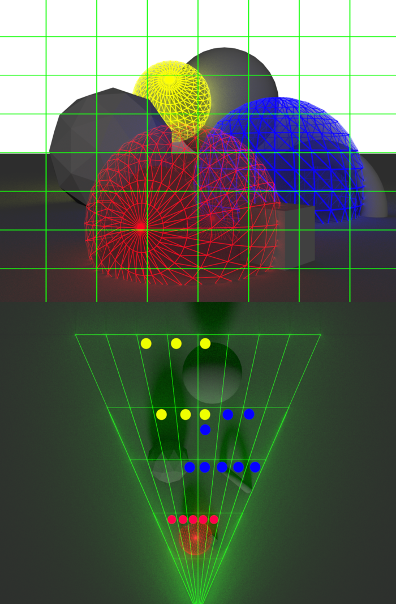
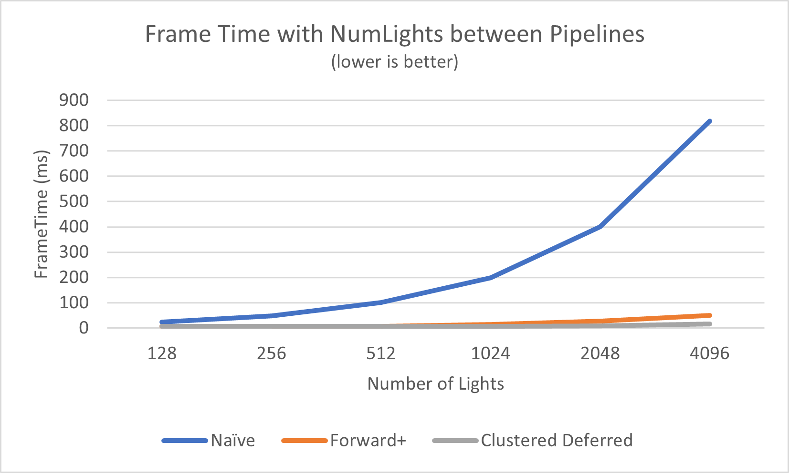
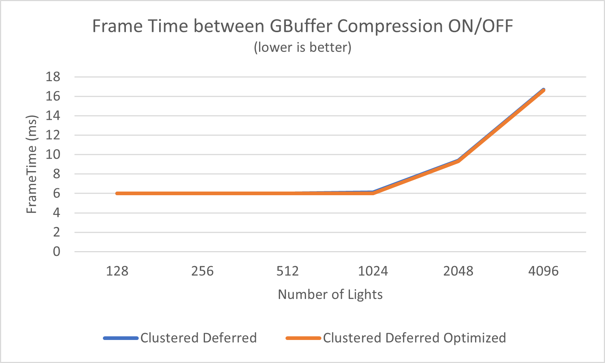
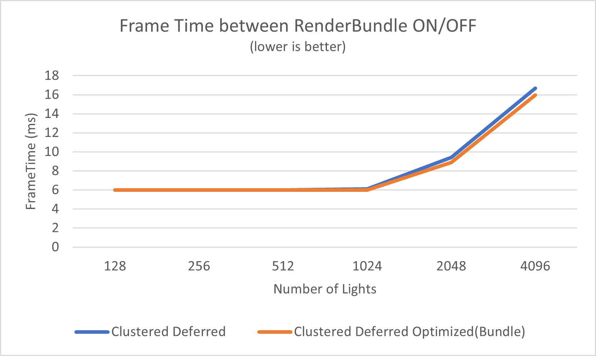

# WebGPU Forward+ and Clustered Deferred Shading

**University of Pennsylvania, CIS 565: GPU Programming and Architecture, Project 4**

-   Yu Jiang
-   Tested on: **Google Chrome 141.0.7390.77** on
    Windows 11, Ultra 7 155H @ 3.80 GHz, 32GB RAM, RTX 4060 8192MB (Personal Laptop)

### Screenshot

### Live Demo

https://nmdwsm0.github.io/Project4-WebGPU-Forward-Plus-and-Clustered-Deferred/

### Demo Video

  
Click to watch this video on youtube

### Features

#### Naive

In the naive implementation, the fragment shader has to check all lights in the scene and compute their contribution for the fragment.

#### Forward+

In the Forward+ shading pipeline, an additional Compute Pass is added to compute for each cluster: all the lights which can have impact on this cluster.

In the implementation, the screen is devided into several 64\*64 pixels tiles, and each tile is devided into 16 clusters along z axis. The compute shader is launched 1 thread per cluster, and check all the lights in the scene whether they intersect with this frustrum. The intersection checking is done by checking whther the light sphere is in the inner side of each planes, and a cluster is composed of 6 planes.

  
This picture is from https://www.aortiz.me/2018/12/21/CG.html

In the final shading pass, each fragment firstly compute the cluster it belones to, and only check the light list of that cluster instead of all the lights.

#### Clustered Deferred

Light clustering is the same as Forward+. But in the deferred shading, we firstly shade the whole scene and only record the albedo, normal, and depth of each fragment. Thoses values are depth-tested and only saved the active fragment's data of each pixel.

Then in the shading pass, we read albedo, normal and depth from the GBuffer saved previously, and reconstruct the view space position, then use those information to shade with clusters data.

### Performance Analysis

All following test results are rendered at 2090x1582 resolution on **Google Chrome 141.0.7390.77** with RTX 4060.

#### Comparison of Forward+ and Clustered Deferred shading

Here is a plot showing the frametime with number of lights

And here is the table of frametime with **4096 lights**

|  Shading Pipeline  | FrameTime(ms) | Improvement to Naïve |
| :----------------: | :-----------: | :------------------: |
|       Naïve        |     818.6     |         1.0          |
|      Forward+      |     50.1      |         16.3         |
| Clustered Deferred |     16.7      |         49.0         |

We can figure out that Forward+ and Clustered Deferred are much faster than Naive pipeline when number of lights grows. This shows that clustering lights significantly reduces the number of lights to check compared to iterating lights in the whole scene, so the shading time decreases.

We can also see that Clustered Deferred is faster than Forward+ when number of lights is greater than 1024. That's because although Forward+ decreases the number of lights to check, it still costs lots of time on shading all fragments of each triangle. But using deferred shading we can only compute lights on those fragments which can directly show on the screen. This saves more time than the time of reading the GBuffer, especially with a RTX 4060 GPU which has a large memory bandwidth and in this project we have very few GBuffers (even no PBR).

There's a very tricky situation that **V-Sync cannot be turned off** in WebGPU, and the WebGPU Inspector cannot show the frametime exactly when fps > screen refresh rate either. So the minimum frametime is always 6ms in all the plots.

#### Comparison of GBuffer Compression for Clustered Deferred

I recorded the frametime of Clustered Deferred with and without GBuffer Compression, the result is following:

Unfortunately, there's almost no improvement doing the compression.

After I checked my implementation, I found the reason:

1.  In the original Clustered Deferred implementation, I doesn't use extra buffers like _positions_, I have already used the depth values to reconstruct view space positions.
2.  For the remaining buffers, I have already used minimized data types: `rgba8unorm` for albedo, `rgba16float` for normal, and `depth24plus` for depth, they only take 4 + 8 + 4 = 16 bytes per pixel.
3.  After the compression, I compressed albedo into one `u32`, normal into one `u32`, and depth into one `u32`, there should be 3 \* 4 = 12 bytes per pixel theoretically, but WebGPU **doesn't have data types like `rgb32uint`, it only have `rgba32uint`!** So if want to put all values in one buffer, I still have to use 16 bytes per pixel, which saves **0 bytes** per pixel. The only improvement is it combined 3 different buffers into one buffer, but this fetching time is much less than the time of shading on lights.

#### Comparison of RenderBundle for Clustered Deferred

Here is the plot showing the frametime comparison after enabling renderbundles.

We can see that there is some improvements after enabling it(after frametime > 6ms). But the improvement is not huge. I think that's because there are not too many drawcalls in this scene, if we have features like _cascaded shadow map_ which significantly increases drawcalls, then the improvements will be more obvious.

### Credits

-   [Vite](https://vitejs.dev/)
-   [loaders.gl](https://loaders.gl/)
-   [dat.GUI](https://github.com/dataarts/dat.gui)
-   [stats.js](https://github.com/mrdoob/stats.js)
-   [wgpu-matrix](https://github.com/greggman/wgpu-matrix)

### References

-   [Light Clustering Picture](https://www.aortiz.me/2018/12/21/CG.html)
